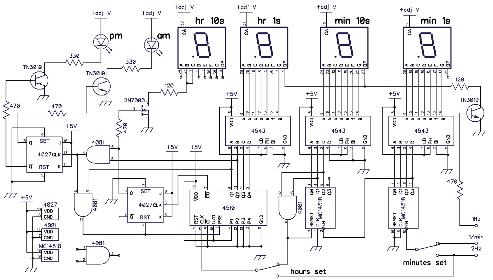

# Reference Designs

- [An Old-School Digital Clock - Nuts & Volts](https://www.nutsvolts.com/magazine/article/April2017_CMOS-ICs-Digital-Clock)

- [
Learning Sequential Logic Design for a Digital Clock by hp07](https://www.instructables.com/Digital-Clock-Sequential-Logic-Design/)